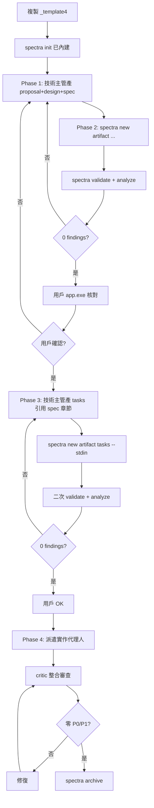

# Spectra Workflow — {project_name}

> 模板：`_template4` | 全域 SOP：memory `feedback_new_project_sop.md`
> **全域流程主檔**：`C:\flaskspace\Claude\docs\GLOBAL_WORKFLOW_V2.md`（v2 SoT，請優先讀）
> **Slash 命令**：`.claude/commands/spectra-validate.md`、`spectra-apply.md`、`critic-gate.md`

## 為何要走 Spectra Gate

避免「技術主管一次產 proposal+design+tasks 全包」造成的問題：
1. 規格未確認就拆 tasks → 後續 spec 改，tasks 全廢
2. 任務 acceptance 沒引用 spec → 驗收標準浮動
3. 用戶看不到結構化規格 → 只能看 markdown 任務書，無法判斷整體完整性

## v2 SOP 階段圖



## Spectra 四種 artifact 對照

| Artifact | 內容 | 由誰產 | 何時產 |
|----------|------|--------|--------|
| `proposal` | 為什麼做、目標、範圍 | 📋 planner | Phase 1 |
| `design` | 怎麼做、架構、技術選型、風險 | 📋 planner | Phase 1 |
| `spec {capability}` | 規格章節、行為定義、驗收條件 | 📋 planner | Phase 1 |
| `tasks` | T001~T0NN 拆解、依賴、代理人指派 | 📋 planner | **Phase 3（spec 確認後）** |

## 例外（不走 Spectra Gate）

直接派，不需 proposal/design/spec：
- 🗺 onboarder — 看陌生程式碼
- 📚 web-researcher — 查 API 文件
- 🔍 critic — 對既有程式碼審查
- 🐛 debugger — 既有 bug 修復（小範圍）

## 任務書與 Spectra spec 的引用關係

每個 task 的 acceptance 必須長這樣：
```markdown
### T002 acceptance
1. 對照 spec `image-cropping-core` §3.2「Pass1 演算法不可變」
   → calculate_fixed_count_coords 與原腳本 byte-for-byte 一致
2. 對照 spec §4.1「callback 介面契約」
   → progress_cb / log_cb 為 None 時 fallback 行為正確
```

不准用模糊的 acceptance 例如：
- ❌「裁切結果正確」
- ❌「邏輯與原腳本一致」（沒指 spec 哪一條）

## 命令速查

```bash
SPECTRA="C:/Users/MT2505/AppData/Local/Spectra/spectra.exe"

# 開新 change
$SPECTRA new change {change-name}

# 灌 artifact（從 stdin 讀內容）
echo "..." | $SPECTRA new artifact proposal --change {change-name} --stdin
echo "..." | $SPECTRA new artifact design   --change {change-name} --stdin
echo "..." | $SPECTRA new artifact spec     --change {change-name} {capability} --stdin
echo "..." | $SPECTRA new artifact tasks    --change {change-name} --stdin

# 驗證
$SPECTRA validate
$SPECTRA analyze

# 用戶核對
# 開啟 C:/Users/MT2505/AppData/Local/Spectra/app.exe

# 完成歸檔
$SPECTRA archive {change-name}
```

---

## 8 個踩坑速查（實戰積累）

> 來源：`C:\Users\MT2505\.claude\projects\C--Users-MT2505\memory\feedback_spectra_planner_gate.md`

### 坑 1：proposal 含 `/` 路徑被誤判為 capability
**症狀**：`[CRITICAL] Capability \`openspec/specs/\` has no corresponding spec file`
**解法**：proposal capability 區塊禁寫含 `/` 字串
**Tag**：Phase 1 / Agent 1 planner

### 坑 2：design `### Decision: X` heading 未在 tasks 出現 substring
**症狀**：`[WARNING] Design topic 'decision: X' not referenced in tasks`
**解法**：tasks 每條開頭寫「Decision: <heading 原文> — ...」
**Tag**：Phase 3 / Agent 1 planner

### 坑 3：spec scenario 用 3 個 # 悄悄失敗
**解法**：必 4 個 `#### Scenario:`；寫完 `grep "### Scenario" spec.md` 自查
**Tag**：Phase 1 spec 撰寫

### 坑 4：spec forbidden words
**禁字**：`should / may / might / consider / possibly / TBD / TODO / ??? / TKTK`
**解法**：規範性語句一律 `SHALL / SHALL NOT / MUST / MUST NOT`；空集合用 `empty arrays / null / (none)`
**Tag**：Phase 1 spec 撰寫

### 坑 5：spec 直接寫中文 fail
**解法**：spec 骨幹英文 + `> 中文：…` blockquote 引言
**Tag**：Phase 1 spec 撰寫

### 坑 6：Spectra spec 與 docs/modules/ 衝突無人察覺
**解法**：建 spec 前必跑：
```bash
grep -rn "三欄\|three-column\|左欄\|中欄\|右欄" docs/modules/ docs/*.md
```
用 `### Decision: X authoritative source` 聲明 canonical
**Tag**：主視窗 Step 3

### 坑 7：sub-agent 無 Edit/Write
**解法**：sub-agent 只研究/審查/規劃；主視窗讀 reports 後 Edit/Write 落檔
**Tag**：永遠適用

### 坑 8：feature flag 未設預設 off
**解法**：所有流程切換 change，design.md「Migration Plan」必寫 feature flag + 預設 off + rollback 步驟
**Tag**：Phase 1 design 撰寫

---

## Worktree / Park 進階用法

### worktree（多 change 並行）
- 啟用 `.spectra.yaml`：`worktree: true`
- 行為：每次 `spectra new change <name>` 自動建 git worktree 在 `.spectra/worktrees/<name>/`，分支 `spx/<name>`
- 適用：跨多視窗開發、change 影響大量檔案、想 review diff 不影響 main

### park（暫停不歸檔）
- `spectra park <change>` → Parked 欄
- `spectra unpark <change>` → Doing 欄
- 適用：用戶優先順序變動、等外部依賴、需切到 hotfix
- 與 archive 差別：park 可恢復、archive 不可恢復
